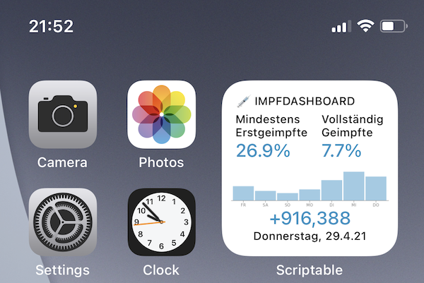

# Impfdashboard Widget

This repo gets the current data of COVID-19 vaccinations in Germany from [impfdashboard.de](https://impfdashboard.de) and allows you to display it as an iOS widget. It shows the following data:

* percentage of first vaccinations
* percentage of fully vaccinated people
* amount of doses administered in the last day
* a bar chart of doses for the last seven days

## How to use

- Download the free [Scriptable app](https://scriptable.app) made by Simon Støvring
- create a new script and copy/paste the contents from [scriptable/Impfdashboard.js](./scriptable/Impfdashboard.js)
- create a new Scriptable widget on your homescreen and choose the script you just created in the edit screen

## Credits
© 2021 [Christian Lobach](https://christian-lobach.de)

[MIT license](LICENSE)

Inspired by the [Corona Ampel Berlin widget](https://gist.github.com/m4p/20cc77b6d9f1f422b75bc3ab6eed0ff3) by 
Martin Pittenauer
