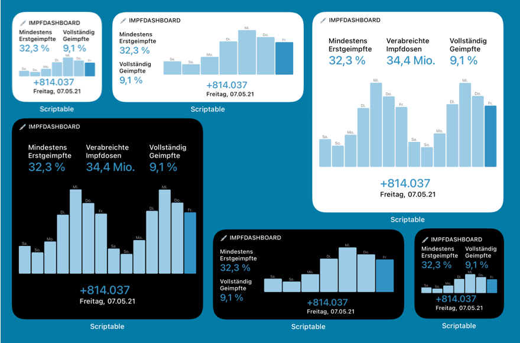

# Impfdashboard Widget

This repo gets the current data of COVID-19 vaccinations in Germany from [impfdashboard.de](https://impfdashboard.de) and allows you to display it as an iOS widget. It shows the following data:

* percentage of first vaccinations
* percentage of fully vaccinated people
* amount of doses administered in the last day
* total cumulative amount of doses administered (large widget only)
* a bar chart of doses for the last seven days

## How to use

1. Download the free [Scriptable app](https://scriptable.app) made by Simon Støvring
2. Import the Impfdashboard script. There are a few different ways to do this (you only need to do one of these):
	- Download [Impfdashboard.scriptable](https://raw.githubusercontent.com/DerLobi/impfdashboard-scriptable-widget/main/scriptable/Impfdashboard.scriptable) on your Mac and send it to your iPhone via AirDrop. Choose "Open with Scriptable" and then "Add to My Scripts".

	- **OR** download [Impfdashboard.scriptable](https://raw.githubusercontent.com/DerLobi/impfdashboard-scriptable-widget/feature/scriptable-file/scriptable/Impfdashboard.scriptable) on your iPhone/iPad, open it with Scriptable and then choose "Add to My Scripts".

	- **OR** Download [Impfdashboard.js](https://raw.githubusercontent.com/DerLobi/impfdashboard-scriptable-widget/main/scriptable/Impfdashboard.js) and move it into the Scriptable folder in iCloud Drive. It will be installed in Scriptable automatically

	- **OR** create a new script and copy/paste the contents from [Impfdashboard.js](https://raw.githubusercontent.com/DerLobi/impfdashboard-scriptable-widget/main/scriptable/Impfdashboard.js)
3. create a new Scriptable widget on your homescreen and choose the script you just created in the edit screen

## Credits
© 2021 [Christian Lobach](https://christian-lobach.de)

[MIT license](LICENSE)

Inspired by the [Corona Ampel Berlin widget](https://gist.github.com/m4p/20cc77b6d9f1f422b75bc3ab6eed0ff3) by 
Martin Pittenauer
